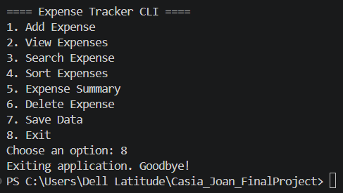

# Expense Tracker CLI

## Project Title
Expense Tracker CLI — Personal budgetbuddy Tracker

---

## Brief Description

Expense Tracker CLI is a command-line Python application designed to help users manage their daily expenses efficiently. The system allows users to add, view, search, sort and delete expense records, calculate total spending, and save data using JSON file storage.

This project demonstrates intermediate Python programming concepts such as:
- Object-Oriented Programming (OOP)
- File handling
- Data structures and collections
- Searching and sorting algorithms
- Exception handling
- Data processing

---

## Features List

### Expense Management
- Add new expenses
- View all expenses
- Delete expenses

### Search and Sorting
- Search expenses by category or description
- Sort expenses by amount

### Reports and Calculations
- Calculate total expenses
- Display expense summaries

### Data Persistence
- Automatically save expense records using JSON
- Load saved records when the application starts

### Error Handling
- Handles invalid numeric input
- Prevents invalid menu selections

---

## Installation / Setup Steps

1. Clone the Repository
Clone this repository to your local machine using git:

```bash
git clone https://github.com/jocasia-sketch/Casia_Joan_FinalProject.git
```

2. Open the Project Folder
Navigate inside the project directory:

```bash
cd Casia_Joan_FinalProject
```

3. Run the Application
Execute the primary python entry script within your terminal:

```bash
python src/main.py
```

---

## 🖼️ Sample CLI Usage & Walkthrough

Here is a visual guide on how the system operates in sequence:

### 1. Welcome State
When launched, you are greeted with the interactive terminal dashboard menu.


### 2. Creating an Item
You can choose option logs to add item entries.


### 3. Reviewing Records
Check all stored tracking values inside an organized grid.


### 4. Querying and Searching
Filter through large sets of values by choosing specific lookup items.


### 5. Array Sorting
Re-order visual priority listings by total transaction value scales.


### 6. Analytics Review
View summarized metric calculations instantly.


### 7. Deleting Records
Purge entries instantly using individual object configurations.


### 8. System Persistence & Exit
Ensure stability by committing records to disk storage when you log off.



---

## Video Demonstration

YouTube Link:
https://youtu.be/WI9BBvlnjE4